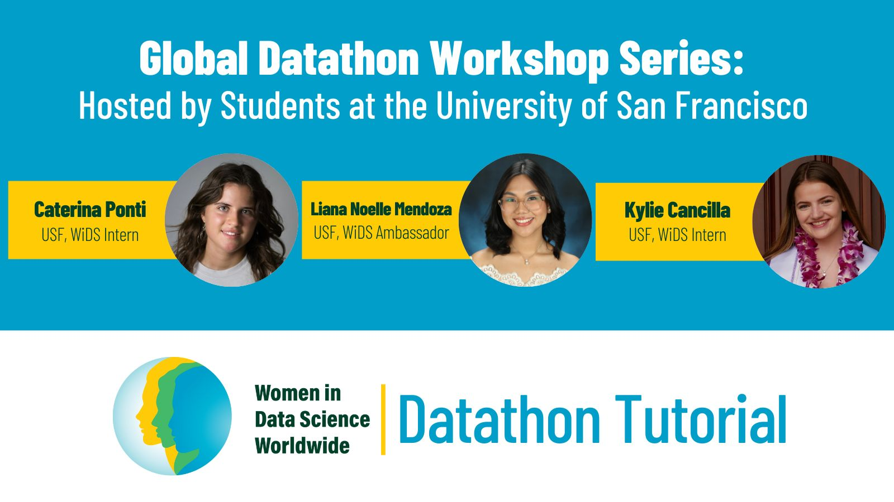

Women in Data Science (WiDS) Worldwide hosts an annual datathon. For the 2025 event, I led three workshops that provided guidance on tackling the challenge, which focused on predicting ADHD in adolescent girls using socio-demographic, parenting, and connectome data.

Watch the workshop recordings here:
<ul>
  <li><a href="https://www.youtube.com/watch?v=Lp-4rtCEVKY" target="_blank">Workshop 1: Introduction to the Challenge and Dataset</a></li>
  <li><a href="https://www.youtube.com/watch?v=gicfuCLuosA" target="_blank">Workshop 2: Dataset Preprocessing and Preparation</a></li>
  <li><a href="https://www.youtube.com/watch?v=yGoLwclZyQw" target="_blank">Workshop 3: Building & Evaluating a Machine Learning Model</a></li>
</ul>
