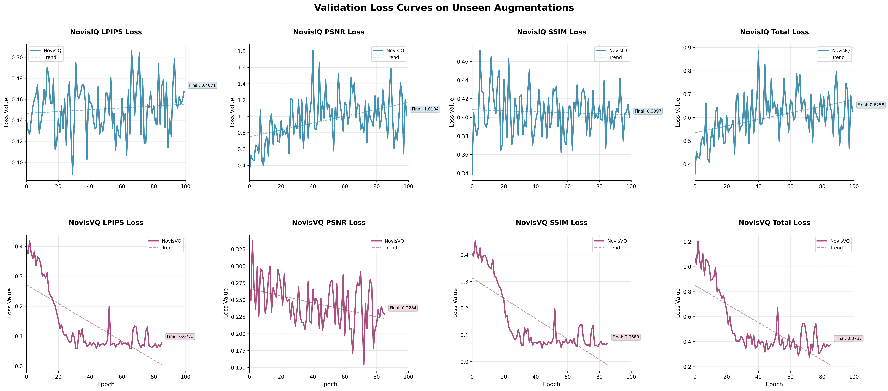
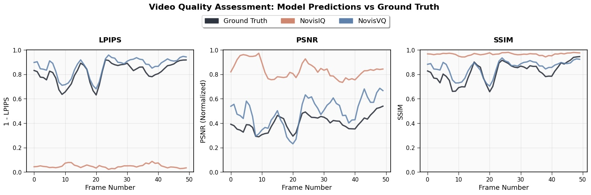

  <a href="https://arxiv.org/pdf/2511.04628" target="_blank" class="btn btn-primary">📄 View Paper on ArXiv</a>

After my summer research at Livermore Labs I was able to continue to collaborate with my team to improve our model from an image-based approach to a streaming-based approach that significantly improved accuracy and ability to generalize to real world data. 

Abstract: Video quality assessment (VQA) is vital for computer vision tasks, but existing approaches face major limitations: full-reference (FR) metrics require clean reference videos, and most no-reference (NR) models depend on training on costly human opinion labels. Moreover, most opinion-unaware NR methods are image-based, ignoring temporal context critical for video object detection. In this work, we present a scalable, streaming-based VQA model that is both no-reference and opinionunaware. Our model leverages synthetic degradations of the DAVIS dataset, training a temporalaware convolutional architecture to predict FR metrics (LPIPS , PSNR, SSIM) directly from degraded video, without references at inference. We show that our streaming approach outperforms our own image-based baseline by generalizing across diverse degradations, underscoring the value of temporal modeling for scalable VQA in real-world vision systems. Additionally, we demonstrate that our model achieves higher correlation with full-reference metrics compared to BRISQUE, a widely-used opinion-aware image quality assessment baseline, validating the effectiveness of our temporal, opinion-unaware approach.

